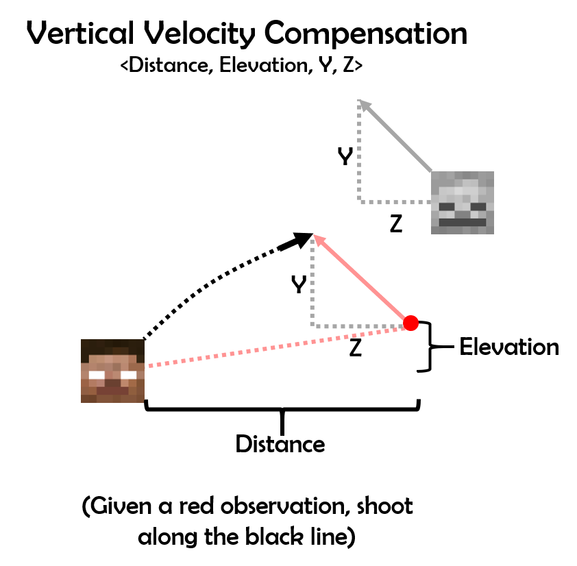

## Video
<iframe width="560" height="315" src="https://www.youtube.com/embed/fhauQzM92Cc" frameborder="0" allow="accelerometer; autoplay; encrypted-media; gyroscope; picture-in-picture" allowfullscreen></iframe>

## Project Summary
The goal of our project is to teach an agent to aim and shoot at enemies with a bow. Because arrows take time to travel and are affected by gravity, successfully hitting targets is not a trivial task. The agent will need to learn to aim higher for airborne or distant targets. Targets can also move in any direction and the agent must become capable of compensating for the target's velocity when aiming. The map will be a flat world with no obstacles that would affect aiming. One additional requirement our team decided on was that the agent should not require any human intervention when training. If the agent were to be dropped into an environment with no knowledge, it should be capable of learning how to hit any target to the best of its ability. Because our team is using a linear regression model, this means that all data points must be collected by the agent and that it must be able to begin with an empty data set.

<p align="center">
    
</p>

The agent's input will be an observation from Malmo about the position of all entities in the environment as well as the id of a target to shoot at. The output will be the angular distance that the agent must turn in order to hit the target. In other words, the output informs the agent how far left/right and up/down it should turn before releasing the arrow. The agent's only actions are turning left/right and up/down. All shots are fired at full charge so that targets further away can be hit.

## Approaches
Our agent learns how to shoot accurately at a bow using linear regression. Linear Regression is a way to model a relationship between some number of independent variables and a dependent variable. Given information from the environment, such as distance to target and the target's velocity, the model should return a scalar value representing how far to turn to shoot at a given target. The model is generated by collecting data points and plotting a regression curve that minimizes mean squared error. Our initial approach used a separate linear regression model for pitch and yaw, the two aiming axes. This splitting of axes is valid because the yaw and pitch aiming values are calculated independently of each other; targets moving left or right do not affect how high the agent must aim. The regression equations are calculated using SciKit-Learn's LinearRegression class, which fits data and targets to a linear regression equation using least-squared error optimization. Our agent does not receive any data before trials start, instead the agent makes some shots under other criteria to get a comprehensive range of data so regression will be more generalized.

There are two baselines that we will be measuring agent performance against. One baseline will be an untrained AI that simply aims in random directions. The odds that a random shot will hit an enemy is very low, but it is important that we prove that the agent we develop performs better than random chance. The other baseline will be performance relative to a human player. This baseline is more subjective, but the AI doesn't need to be perfect to be considered a success. Having performance relatively near human capabilities would be a success in our eyes.

### Data Collection
Because linear regression predicts output values based on existing data points, generating a data set effectively was a crucial component of our project. A naive approach would be to only record shots that hit the target. The problem with this is that the model requires data points to hit the target in order to acquire data points, which is a clear catch-22. Another would be to shoot the target manually and give those to the model as an intial data set. Our team decided against this because we wanted to build an AI that can be entirely autonomous and learn without human intervention. 
<p align="center">
    
</p>
The method our team used to gather data is to use every point along each arrow trajectory as a data point for the linear regression model. If the agent shoots an arrow in some direction and it passes through point (X,Y), then the agent knows that it can hit targets at (X,Y) by shooting in the same direction. This logic holds for each and every unique point along the arrow's trajectory and a valid data point can be generated from each one. Instead of a system where successfully hitting a target is one data point and missing is zero, our method returns dozens of data points per shot and is independent of whether or not the target was hit by the arrow. This allows our agent to train very quickly, to the point where training can be measured in minutes and not hours.<br>
The switching between shooting and collecting data is done in a loop. The basic pseudocode goes like this for the loop:
```python
def loop():
    while True:
        # Either aim and shoot or measure arrow trajectory
        # Wait one tick in time to get new observations
```
There are some other modifications to this loop to speed up training, but this general process is the key to getting data points.

### Static Target Aiming
#### Vertical Aiming
<p align="center">
    
</p>

> Polynomial Features (degree=3): ['1', 'x', 'y', 'x^2', 'x y', 'y^2', 'x^3', 'x^2 y', 'x y^2', 'y^3']

For vertical aiming, our agent uses regression with using the features of distance from the target and difference in elevation from the target (if the target is higher than the shooter, the elevation is positive). The linear regression model takes polynomial combinations of these features as input. The output of this regression is the vertical angle needed to aim to hit a target at the given distance and elevation. The following equation is the regression equation our agent currently uses to aim vertically:<br><br>
$$angle = a + b*distance + c*elevation + d*distance^2 + e*distance*elevation + f*elevation^2 + g*distance^3 + h*distance^2*elevation + i*distance*elevation^2 + j*elevation^3$$<br><br>
Before our agent uses this regression equation, it shoots arrows at multiple angles steadily proceeding upward to ensure a spread of data points are available when it starts using regression. A figure below shows how data is stored and how the agent calculates predictions over many distances and elevations. The prediction graph uses the regression equation that is $$angle \approx 16.0 - 0.634*distance + 1.77*elevation - 0.0116*distance^2 - 0.0378*distance*elevation + 0.0447*elevation^2 - 0.0000415*distance^3 + 0.000263*distance^2*elevation - 0.000220*distance*eleavation^2 - 0.000488*elevation^3$$.
<p align="center">
    
</p>

#### Horizontal Aiming
<p align="center">
    
</p>

> Polynomial Features (degree=1): ['1', 'x']

For horizontal aiming, our agent uses regression with only one feature: the angle between the player's current facing direction and the target's position. The output of the regression model is how many degrees the player must turn to face the target. This is distinct from the vertical aiming model because the output is relative to the player's current facing direction. This makes the data points more general and applicable in more situations. As an example, turning from 45 degrees to 30 degrees (a difference of 15) is treated the same as turning from 20 degrees to 5 degrees. Against stationary targets, no other factors are necessary because there are no environmental forces that will curve arrows horizontally in flight. The following equation is the regression equation our agent currently uses to aim horizontally:<br><br>
$$angle = a + b*hori_angle$$<br><br>
Before our agent uses this regression equation, it takes a few randomly decided shots so it will build a spread of data points before utilizing the regression model. However, because the aiming angle matches with the relative angle of the target, this regression is trivial and very few points of data are needed to get good predictions. Because the aiming here is so trivial, figures are not necessary to show as the regression equation will converge to $$angle = 0 + 1*hori_angle$$.

The gathering of data from the agent comes with some caveats. The first one is that when an arrow is fired in Minecraft, there is some random divergence of the angle on which you have shot at. For example, if you shoot at 44 degrees up, the arrow may travel starting at 43 or 45 degrees. This creates some noise within the data, meaning that more data is needed to get an accurate regression function. The second problem is that Malmo does not track arrows perfectly. In the first figure, some travel paths have distinct "bumps" that shouldn't exist in the arrow's actual path of travel in Minecraft. This creates even more noise and means that even more data is needed to counteract this potential error in measurement. 

### Moving Target Aiming
#### Initial Approach
Creating a model that can reliably hit non-moving targets was not overly difficult, but generating a regression model that can accurately shoot at moving targets was quite challenging. Our team's initial approach was to add all of the relevant features into a regressor and directly output the direction the agent should shoot at to hit a moving target. This approach was flawed and did not perform well. One problem was that we were adding in too many degrees of freedom, leading to overfitting. Compared to the exponential number of possible combinations of distance, X velocity, Y velocity, Z velocity, and Δ angle, the amount of data points we were collecting were insufficient. The agent would learn how to shoot at targets moving left at a specific speed, but fail on targets moving to the right. Training against moving targets would also train it to fail against non-moving targets when the regression line refused to be centered at (0,0), causing it to miss. There was a loss of generality of the data set, as each shot only really gave information about the situation where the agent is aiming in a specific direction against a target at a specific distance moving in a specific direction.
<p align="center">
    
</p>
This can be shown in the above diagram. Any slight change to the target's distance, velocity or the agent's facing direction will impact the predicted turning angle. 

#### Fixing our Approach
<p align="center">
    
</p>
The way our team solved this problem was by rethinking how aim is represented. Before, aim was represented by the Δ angle that the agent must turn by. Afterwards, aim is represented by the sum of the Δ angle to directly aim at the target and the Δ angle to lead a moving target. This meant splitting what was a single linear regression model into two simpler ones: one to aim at the target (trivial) and one that modifies an on-target aim based on the target's velocity. These two models act independently of each other. The direct angle is not influenced by the target's velocity and the leading angle is independent of the agent's facing direction.

#### Horizontal Aiming
<p align="center">
    
</p>

> Polynomial Combinations (degree=2): ['1', 'x', 'y', 'z', 'x^2', 'x y', 'x z', 'y^2', 'y z', 'z^2']

With direct and leading angles separated, the problem of compensating for target velocity becomes simpler. The leading model assumes that the agent is facing the target's position at the time of aim calculation. The input features of the linear regression model are distance, X-velocity, and Z-velocity. The linear regression model takes polynomial combinations of these features as input. We also adjust the sign of the polynomial features to ensure that if, for example, X-velocity is negative, then $$X-velocity^2$$ is also negative; this is done to keep symmetry. The output is the Δ yaw angle that represents how much of an angular offset is needed to hit the moving target. The agent keeps track of how far the target has moved from when the arrow was released. At each point in time, the target has moved some distance.  
<p align="center">
    
</p>

As the diagram above demonstrates, the distance that the target has moved can be applied to each arrow position, giving the agent knowledge of how to shoot targets that begin at the arrow's current position and move in the same manner. Just like with training against static targets, dozens of data points can be harvested per shot, decreasing training time drastically. 

#### Vertical Aiming
<p align="center">
    
</p>

> Polynomial Combinations (degree=3): ['1', 'x', 'y', 'z', 'x^2', 'x y', 'x z', 'y^2', 'y z', 'z^2', 'x^3', 'x^2 y', 'x^2 z', 'x y^2', 'x y z', 'x z^2', 'y^3', 'y^2 z', 'y z^2', 'z^3']

Leading targets moving vertically is done in a similar manner to leading targets moving horizontally. The input features of the linear regression model are distance, elevation, and Y-velocity. The linear regression model takes polynomial combinations of these features as input. We modify the signs of these features the same way as before to keep them symmetric as well. The output is the Δ pitch angle that represents how much of an angular offset is needed to hit the moving target. 

The offset of the target at each point in time is applied to each arrow position along the trajectory. The main difference is that, due to gravity, a straight line to the red point can't be used. Instead, the output is the difference between the pitch of the current shot and the predicted angle necessary to hit the red point. This may seem like a minor difference, but this does make vertical aiming compensation less reliable than horizontal aiming compensation because the predicted Δ angle for leading is dependent on a predicted direct aim angle. That is, the regression model takes in the output of another, possibly imperfect, regression model. Any poor performance of the direct aim regression model will negatively influence the leading aim regression model.

## Evaluation
### Hit Percentage
Hit percentage is, by far, the most important metric for our AI. A successful AI, in our eyes, is an AI that can reliably hit targets. We wish to maximize the agent's accuracy, pushing it as close to 100% as possible. The graph below displays the accuracy per mission, on a scale from 0% to 100%. Accuracy is defined as the number of shots that hit divided by the total number of shots taken. Missions last for 60 seconds before restarting. The target's position is randomized between missions, with distances ranging from 10 to 50 blocks away from the agent. 

#### Static Targets
<p align="center">
    
</p>

> Total Accuracy: 344/395 -- 87.0%

This is the agent's accuracy against a non-moving static target that is in the air. There is a clear upward trend as the agent rapidly learns how to aim at targets that do not move. It is very simple to generate an optimal regression curve when velocity is not a factor in aiming. The high accuracy means that the linear regression model has accurately modeled the physics of the world and is able to predict how high the agent needs to aim to hit targets in the air or at distance.
#### Moving Targets
<p align="center">
    
</p>

> Total Accuracy: 33/56 -- 58.9%

This is the agent's accuracy against moving targets on the ground. There is an upward trend as the agent learns to hit moving targets, but it doesn't hit as many shots as we would like it to. While the AI is capable of leading moving targets, it does so inconsistently. Still, this is better performance than an AI that does not attempt to adjust for target movement. The AI has made a great deal of progress to reach the performance it has, but it is far from optimal. It is possible that the agent is experiencing overfitting, which is preventing it from accurately leading targets in unknown situations. 

### Closeness of Shots
A good qualitative metric to measure our agent is measuring how close each shot gets to the target, then seeing if the training reduces these errors over time. Our ultimate goal with the errors in general is to reduce them to 0 for every shot. Seeing how the agent makes its error trend downward in different situations can give information on if the regression implementation is functioning properly. Error per shot is the minimum distance in blocks that an arrow got to the target over its travel time. Error trends are tested on still targets, horizontally moving targets, and vertically moving targets.

#### Static Targets
<p align="center">
    
</p>
This is the error graph shown during the very first moments of training, pitting the agent against a target that stays completely still so it can get a hold on what to do for more complex missions. There is a clear divide as the agent transitions from doing random moves in order to learn how the environment works into using a near-flawless regression line and hitting the target (or getting close) for every shot. The downward trend is clear just from the transition alone, and the agent doesn't have much room for improvement at this point.

#### Left/Right Moving Targets
<p align="center">
    
</p>
This is the error graph shown during the first mission involving targets that move horizontally relative to the shooter. The divide between data points is not as clear here, but the few outliers that exist on the earlier pars of this graph do not occur later as the agent learns how movement affects its aim. The downward trend is also not as apparent as the still targets as the agent doesn't fully "solve" the problem of aiming ahead of targets in all situations. Despite this, the improvements the agent makes can be seen as a moderate success for forming a more complex regression equation.

#### Up/Down Moving Targets
<p align="center">
    
</p>
This is the error graph shown during the first mission involving targets that move vertically relative to the shooter. The divide between data points is definitely more apparent in this graph as the agent suddenly gets a hold of how to lead vertically and get closer to hitting the target. The downward trend is not really apparent until this improvement is made, making it a similar situation to the improvements on still tarets. Our agent accomplishes at least in improving its aim, but the errors that are shown even in the later stages of the training period can leave more to be desired.

### Comparing to a Random Agent and a Human
One of the easiest ways to quantitatively evaluate the performance of an agent is to test it against untrained agents and humans.  The comparisons will take place by shooting horses in a range about 30 blocks away from the player, trying to kill as many as possible in 60 seconds. Comparing against an untrained/random agent is trivial; the random agent very rarely hits the target, not managing to kill any horses, and our agent only needs to use its learning marginally to show its superiority. Comparing against a human's performance is more interesting. In the given time span, our agent managed to kill 3 of the horses and was on its way to kill the next one, and the human agent barely killed 4. This means that our agent is comparable to a human in performance, at least in this situation. The agent was better at aiming the initial shot than the human, but the human was better at correcting and switching targets. Both the human and the agent had troubles leading shots as horses sporadically moved. This is no moon-shot case where the agent decimates the human in performance, but these results hold significant implications for our agent.

## Conclusion
### Overall Performance
Our agent has made significant progress towards shooting targets since its untrained days. Overall, the agent can perform similarly to humans in some situations. It can perform better in certain situations (such as shooting very far still targets) and worse in others (such as shooting high-velocity, but close targets). While the agent probably can't survive an actual encounter with an Ender Dragon, the agent can be applied very well as an autonomous shooting turret for many types of targets.

### What to Improve
The flaws of the method of regression are made apparent as more diverse situations are given to the agent to learn. One problem that the agent had was not being able to lead shots on targets that were far away and running from the shooter. This could be solved by having a more handpicked equation of regression for our horizontal leading, such as dividing parameters, using logs of parameters, and more. Another problem was that as our data set gets bigger, the time to fit for regression takes longer and aiming becomes slower. It is possible to delete some data points to keep size down, but deleting data poorly can ruin agent performance. We could have also used z-velocity for the vertical leading like we did for horizontal leading, but we were having trouble with using it in horizontal leading and didn't want to risk losing performance loss with our time to work.

## References
- [Matplotlib](https://matplotlib.org/)
- [NumPy](https://www.numpy.org/)
- [SciKit-Learn](https://scikit-learn.org/stable/)
  - Linear Regression [~](https://scikit-learn.org/stable/modules/generated/sklearn.linear_model.LinearRegression.html)
  - Polynomial Features [~](https://scikit-learn.org/stable/modules/generated/sklearn.preprocessing.PolynomialFeatures.html)
