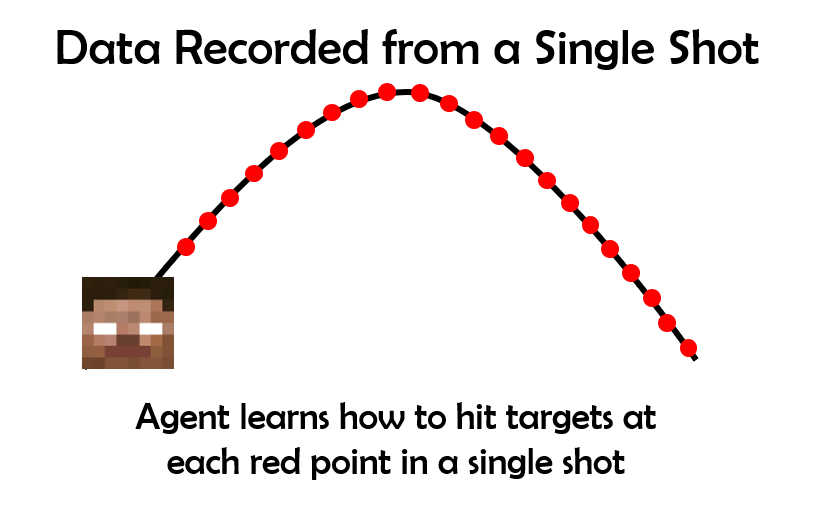
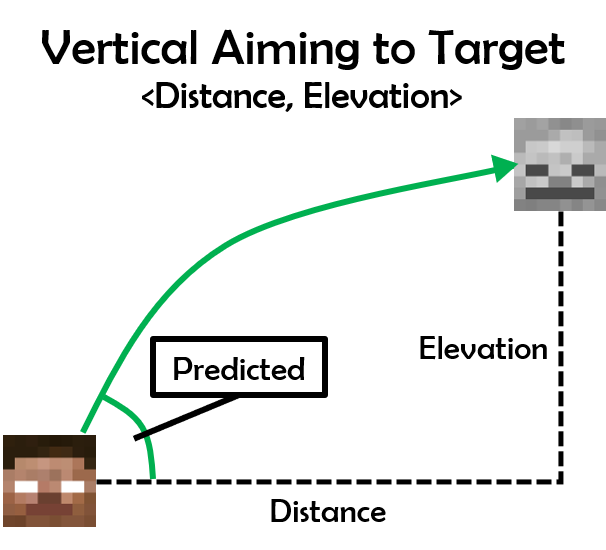
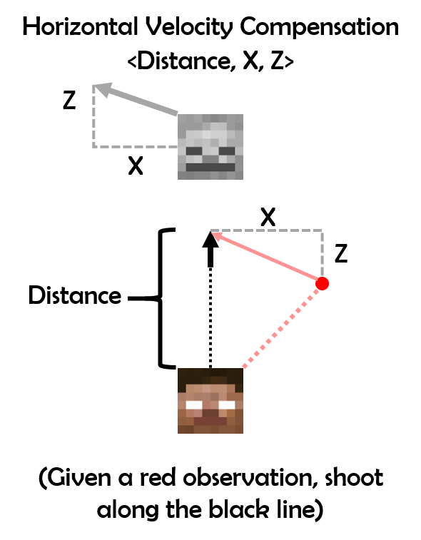

## Video
<iframe width="560" height="315" src="https://www.youtube.com/embed/K5Zn3xCUkDA" frameborder="0" allow="accelerometer; autoplay; encrypted-media; gyroscope; picture-in-picture" allowfullscreen></iframe>

## Project Summary
For our project, we have a Minecraft agent with a bow and use reinforcement learning to teach it to shoot targets at a distance. Our input is an observation from Malmo indicating the target’s location/distance relative to the agent’s position and rotation. Our output is the actions that the agent takes in that situation (i.e. changes in pitch and yaw) and the result of the actions taken in the given situation. At the time of the status report, we had implemented an agent that could accurately shoot a non-moving target by adjusting both its horizontal and vertical aim for targets on the same elevation as our agent and even targets elevated above our agent.
Now, by the final report we have managed to account for a target's velocity and can accurately shoot a target moving in a constant direction.

    

## Approaches
Our agent learns how to shoot accurately at a bow using linear regression. Linear Regression is a way to model a relationship between some number of independent variables and a dependent variable. 
Given information from the environment, such as distance to target and the target's velocity, the model should return a scalar value representing how far to turn to shoot at a given target. The model is generated by collecting data points and plotting a regression curve that minimizes mean squared error. Our initial approach used a separate linear regression model for pitch and yaw, the two aiming axes. This splitting of axes is valid because the yaw and pitch aiming values are calculated independently of each other; targets moving left or right do not effect how high the agent must aim. The regression equations are calculated using SciKit-Learn's LinearRegression class, which fits data and targets to a linear regression equation using least-squared error optimization. Our agent does not receive any data before trials start, instead the agent makes some shots under other criteria to get a comprehensive range of data so regression will be more generalized.

### Data Collection

Because linear regression predicts output values based on existing data points, generating a data set effectively was a crucial component of our project. A naive approach would be to only record shots that hit the target. The problem with this is that the model requires data points to hit the target in order to acquire data points, which is a clear catch-22. Another would be to shoot the target manually and give those to the model as an intial data set. Our team decided against this because we wanted to build an AI that can be entirely autonomous and learn without human intervention. 

    

The method our team used to gather data is to use every point along each arrow trajectory as a data point for the linear regression model. If the agent shoots an arrow in some direction and it passes through point (X,Y), then the agent knows that it can hit targets at (X,Y) by shooting in the same direction. This logic holds for each and every unique point along the arrow's trajectory and a valid data point can be generated from each one. Instead of a system where successfully hitting a target is one data point and missing is zero, our method returns dozens of data points per shot and is independent of whether or not the target was hit by the arrow. This allows our agent to train very quickly, to the point where training can be measured in minutes and not hours.

### Static Target Aiming
#### Vertical Aiming

    

For vertical aiming, our agent uses regression with using the features of distance from the target and difference in elevation from the target (if the target is higher than the shooter, the elevation is positive). The linear regression model takes polynomial combinations of these features as input. The output of this regression is the vertical angle needed to aim to hit a target at the given distance and elevation. The following equation is the regression equation our agent currently uses to aim vertically:  
$$angle = a + b*distance + c*elevation + d*distance^2 + e*distance*elevation + f*elevation^2$$  
Before our agent uses this regression equation, it shoots arrows at multiple angles steadily proceeding upward to ensure a spread of data points are available when it starts using regression. A figure below shows how data is stored and how the agent calculates predictions over many distances and elevations. The prediction graph uses the regression equation that is $$angle \approx 13.6 + -0.57*distance + 2.3*elevation + 0.006*distance^2 - 0.012*distance*elevation - 0.013*elevation^2$$.

    

#### Horizontal Aiming

    

For horizontal aiming, our agent uses regression with only one feature: the angle between the player's current facing direction and the target's position. The output of the regression model is how many degrees the player must turn to face the target. This is distinct from the vertical aiming model because the output is relative to the player's current facing direction. This makes the data points more general and applicable in more situations. As an example, turning from 45 degrees to 30 degrees (a difference of 15) is treated the same as turning from 20 degrees to 5 degrees. Against stationary targets, no other factors are necessary because there are no environmental forces that will curve arrows horizontally in flight. The following equation is the regression equation our agent currently uses to aim horizontally:  
$$angle = a + b*hori_angle$$  
Before our agent uses this regression equation, it takes a few randomly decided shots so it will build a spread of data points before utilizing the regression model. However, because the aiming angle matches with the relative angle of the target, this regression is trivial and very few points of data are needed to get good predictions. Because the aiming here is so trivial, figures are not necessary to show as the regression equation will converge to $$angle = 0 + 1*hori_angle$$.

The gathering of data from the agent comes with some caveats. The first one is that when an arrow is fired in Minecraft, there is some random divergence of the angle on which you have shot at. For example, if you shoot at 44 degrees up, the arrow may travel starting at 43 or 45 degrees. This creates some noise within the data, meaning that more data is needed to get an accurate regression function. The second problem is that Malmo does not track arrows perfectly. In the first figure, some travel paths have distinct "bumps" that shouldn't exist in the arrow's actual path of travel in Minecraft. This creates even more noise and means that even more data is needed to counteract this potential error in measurement. 

### Moving Target Aiming
#### Initial Approach
Creating a model that can reliably hit non-moving targets was not overly difficult, but generating a regression model that can accurately shoot at moving targets was quite challenging. This isn't a simple trigonometry problem because there is a significant fixed delay between when the aim is calculated and when the shot is released because of the time it takes to turn and aim. Our team's initial approach was to add all of the relevant features into a regressor and directly output the direction the agent should shoot at to hit a moving target. This approach was flawed and did not perform well. One problem was that we were adding in too many degrees of freedom, leading to overfitting. Compared to the exponential number of possible combinations of distance, X velocity, Y velocity, Z velocity, and Δ angle, the amount of data points we were collecting were insufficient. The agent would learn how to shoot at targets moving left at a specific speed, but fail on targets moving to the right. Training against moving targets would also train it to fail against non-moving targets when the regression line refused to be centered at (0,0), causing it to miss. There was a loss of generality of the data set, as each shot only really gave information about the situation where the agent is aiming in a specific direction against a target at a specific distance moving in a specific direction.

    

This can be shown in the above diagram. Any slight change to the target's distance, velocity or the agent's facing direction will impact the predicted turning angle. 

#### Fixing our Approach

    

The way our team solved this problem was by rethinking how aim is represented. Before, aim was represented by the Δ angle that the agent must turn by. Afterwards, aim is represented by the sum of the Δ angle to directly aim at the target and the Δ angle to lead a moving target. This meant splitting what was a single linear regression model into two simpler ones: one to aim at the target (trivial) and one that modifies an on-target aim based on the target's velocity. These two models act independently of each other. The direct angle is not influenced by the target's velocity and the leading angle is independent of the agent's facing direction.

#### Horizontal Aiming

    

With direct and leading angles separated, the problem of compensating for target velocity becomes simpler. The leading model assumes that the agent is facing the target's position at the time of aim caculation. The amount that aiming is affected is then dependent on distance, X velocity, and Z velocity. The agent keeps track of how far the target has moved from when the arrow was released. At each point in time, the target has moved some distance.  

    

As the diagram above demonstrates, the distance that the target has moved can be applied to each arrow position, giving the agent knowledge of how to shoot targets that begin at the arrow's current position and move in the same manner. Just like with training against static targets, dozens of data points can be harvested per shot, decreasing training time drastically. 

#### Vertical Aiming

    

Leading targets moving vertically is done in a similar manner to leading targets moving horizontally. The offset of the target at each point in time is applied to each arrow position along the trajectory. The main difference is that, due to gravity, a straight line to the red point can't be used. Instead, the output is the difference between the pitch of the current shot and the predicted angle necessary to hit the red point. This may seem like a minor difference, but this does make vertical aiming compensation less reliable than horizontal aiming compensation because the predicted Δ angle for leading is dependent on a predicted direct aim angle. That is, the regression model takes in the output of another, possibly imperfect, regression model. Any poor performance of the direct aim regression model will negatively influence the leading aim regression model.

## Evaluation

## References
- [Matplotlib](https://matplotlib.org/)
- [NumPy](https://www.numpy.org/)
- [SciKit-Learn](https://scikit-learn.org/stable/)
  - Linear Regression [~](https://scikit-learn.org/stable/modules/generated/sklearn.linear_model.LinearRegression.html)
  - Polynomial Features [~](https://scikit-learn.org/stable/modules/generated/sklearn.preprocessing.PolynomialFeatures.html)
