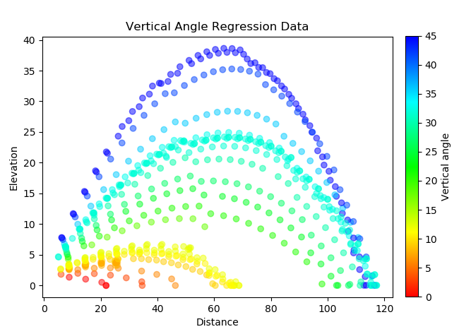
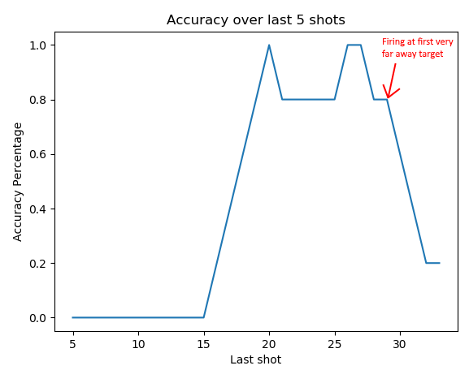
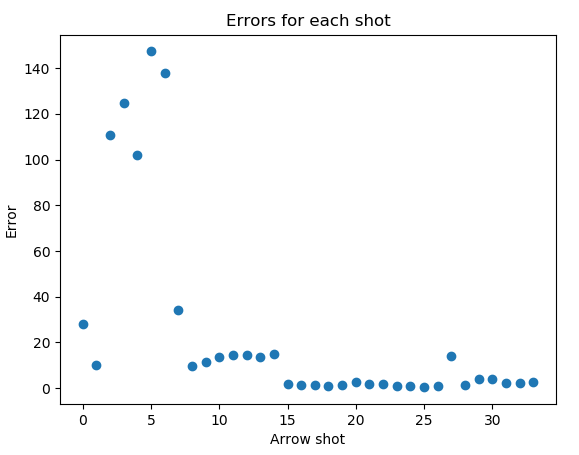
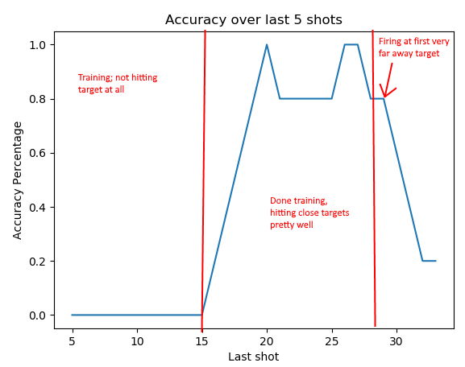
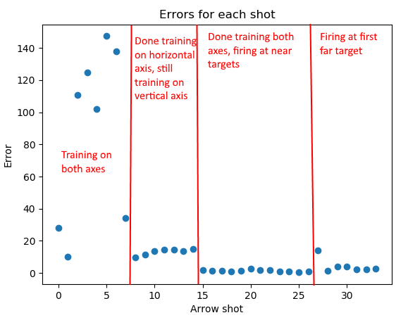

<iframe width="720" height="480" src="https://www.youtube.com/embed/K_xamKkgG7c" frameborder="0" allow="accelerometer; autoplay; encrypted-media; gyroscope; picture-in-picture" allowfullscreen></iframe>

## Project Summary
For our project, we have a Minecraft agent with a bow and use reinforcement learning to teach it to shoot targets at a distance. Our input is an observation from Malmo indicating the target’s location/distance relative to the agent’s position and rotation. Our output is the actions that the agent takes in that situation (i.e. changes in pitch and yaw) and the result of the actions taken in the given situation. By the time of our status report, we have implemented an agent that can accurately shoot a non-moving target by adjusting both its horizontal and vertical aim for targets on the same elevation as our agent and even targets elevated above our agent.

## Approach
Our agent learns how to shoot accurately at a bow using linear regression. Specifically, our agent uses linear regression for the separate axes of aiming that can be done in Minecraft. One regression method is used for horizontal aiming and another is used for vertical aiming, each method using some dimensions of features taken from the game to estimate the angle needed to aim to hit the target with the given features in the same dimensions. The regression equations are calculated through SciKit-Learn's LinearRegression class, which fits data and targets to a linear regression equation using least-squared error optimization. Our agent does not receive any data before trials start, instead the agent makes some shots under other criteria to get a comprehensive range of data so regression will be more generalized.

For vertical aiming, our agent uses regression with using the features of distance from the target and difference in elevation from the target (if the target is higher than the shooter, the elevation is positive). Because of the functionality if physics in Minecraft, we decided to use polynomial combinations of these features as the dimensions of regression. Our output of this regression is the vertical angle needed to aim to hit a target at the given distance and elevation. The following equation is the regression equation our agent currently uses to aim vertically:  
$$angle = a + b*distance + c*elevation + d*distance^2 + e*distance*elevation + f*elevation^2$$  
Angle can range from 0 to 90 currently since we are only testing for targets above the agent. Before our agent uses this regression equation, it shoots arrows at multiple angles steadily proceeding upward so it will always have a lot of data to work with when it starts using regression. A figure below shows how data is stored and how the agent calculates predictions over many distances and elevations. The prediction graph uses the regression equation that is $$angle \approx 13.6 + -0.57*distance + 2.3*elevation + 0.006*distance^2 - 0.012*distance*elevation - 0.013*elevation^2$$.

For horizontal aiming, our agent uses regression with only one feature: the angle of the target relative to the Minecraft world, in degrees ranging from -180 to 180. Like regression for vertical aiming, the output is at which angle the agent should be aiming at horizontally to shoot at the target. We don't need to worry about any other factors for stationary targets as there is no wind or anything else that will curve the arrows horizontally in flight. The following equation is the regression equation our agent currently uses to aim horizontally:  
$$angle = a + b*hori_angle$$  
Before our agent uses this regression equation, it takes a few randomly decided shots so it will have at least some data to make the regression equation have meaning. However, because the aiming angle matches with the relative angle of the target, this regression is trivial and very few points of data are needed to get good predictions. Because the aiming here is so trivial, figures are not necessary to show as the regression equation will converge to $$angle = 0 + 1*hori_angle$$.

The gathering of data from the agent comes with some caveats. The first one is that when an arrow is fired in Minecraft, there is some random divergence of the angle on which you have shot at. For example, if you shoot at 44 degrees up, the arrow may travel starting at 43 or 45 degrees. This creates some noise within the data, meaning that more data is needed to get an accurate regression function. The second problem is that Malmo does not track arrows perfectly. In the first figure, some travel paths have distinct "bumps" that shouldn't exist in the arrow's actual path of travel in Minecraft. This creates even more noise and means that even more data is needed to counteract this potential error in measurement. 

## Evaluation
For evaluation, we have decided to look at a few different measurements to see how our agent is doing. The two quantitative evaluations we measure are: the percentage of hits that the agent gets while trying to shoot its target and how far the agent was from the "center of mass" of the target (i.e. the error rate). A qualitative evaluation that we make can be based on the two quantitative evaluations: finding a "good" firing strategy in a timely manner.

Measuring percentage of hits is relatively straightforward. We can take the number of shots that "hit" the target and divide it by the number of total shots fired and that would give us our percentage. To show how this percentage improves, we can take chunks of some amount of total shots and measure its accuracy, then shift the chunk over one shot and measure its accuracy, and so on until the end. We can say that there is an improvement in accuracy if these percentages increase and trend toward 100% the further along we go in our data. The figure below shows how the agent improves its accuracy over the number of shots in this way. In our trials, our accuracy took a dip because the target was much farther away in our last trial, but the agent was learning as shown in the rest of the graph.

Getting how far the arrows hit from the center of mass is slightly more complicated but still doable. We can define the "center of mass" of our target to be the geometric center that the agent should aim at for maximum chance of hitting the entire target. Since our target is another person, we can say that the center of mass is its coordinates with 1 added to the y-coordinate. The slight transform of the coordinates is done because a human character's coordinates are at the model's feet and the model is relatively 2 units tall. Then, we can find how close the arrow gets to this center of mass. We can measure the arrow in discrete points during its flight, but not the continuous curve it would travel at in reality. To estimate how close an arrow gets, we can take the 2 closest points to the center of mass, approximate a line from those points, and decide the closest point on the "curve" to the center of mass, then take the distance between those two points. We can say that there is an improvement on this metric if the distance from the center of mass decreases over time and trends toward 0.

The single qualitative evaluation that we use to evaluate our agent is whether or not our agent can be "good" at shooting the targets within a timely manner. This measurement should be taken into consideration as it is important for deciding how well our agent would perform in a real-life, real-time situation. We currently define being "good" at shooting targets as being able to shoot stationary targets at a variety of distances and elevations, having an accuracy close to 90% for targets closer than ~25 units away and at least some accuracy for further targets. We need to lower our expectations at further distances due to the random variance in shooting angles as described above. We can define a "timely manner" as not taking an indefinite amount of time to get to our target performance measure. The graphs used for the quantitative measurement are evidence that this qualitative evaluation is met, even with not that many shots to train.

## Remaining Goals and Challenges
Currently, our agent could essentially only fight an army of scarecrows, albeit scarecrows of various distances and elevations. Our remaining goals include the addition of movement to our target. This involves taking the velocity as input and our agent predicting where the target will move in order to lead the shot. This however can prove quite challenging as well since movement is not limited to one dimension. Similar to the previous implementation of aiming, we must think about velocity in two different dimensions (maybe even three for flying enemies!).

## Resources Used
- [Matplotlib](https://matplotlib.org/)
- [NumPy](https://www.numpy.org/)
- [SciKit-Learn](https://scikit-learn.org/stable/)
  - Linear Regression [~](https://scikit-learn.org/stable/modules/generated/sklearn.linear_model.LinearRegression.html)
  - Polynomial Features [~](https://scikit-learn.org/stable/modules/generated/sklearn.preprocessing.PolynomialFeatures.html)
