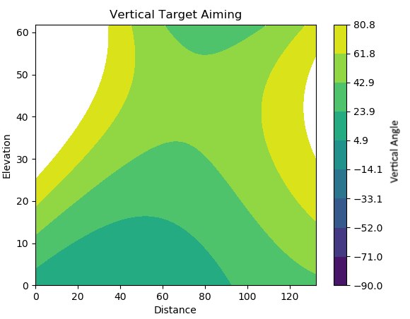

## Project Summary
For our project, we have a Minecraft agent with a bow and use reinforcement learning to teach it to shoot targets at a distance. Our input is an observation from Malmo indicating the target’s location/distance relative to the agent’s position and rotation. Our output is the actions that the agent takes in that situation (i.e. changes in pitch and yaw) and the result of the actions taken in the given situation. By the time of our status report, we have implemented an agent that can accurately shoot a non-moving target by adjusting both its horizontal and vertical aim for targets on the same elevation as our agent and even targets elevated above our agent.

## Approach
Our agent learns how to shoot accurately at a bow using linear regression. Specifically, our agent uses linear regression for the separate axes of aiming that can be done in Minecraft. One regression method is used for horizontal aiming and another is used for vertical aiming, each method using some dimensions of features taken from the game to estimate the angle needed to aim to hit the target with the given features in the same dimensions. The regression equations are calculated through SciKit-Learn's LinearRegression class, which fits data and targets to a linear regression equation using least-squared error optimization. Our agent does not receive any data before trials start, instead the agent makes some shots under other criteria to get a comprehensive range of data so regression will be more generalized.

For vertical aiming, our agent uses regression with using the features of distance from the target and difference in elevation from the target (if the target is higher than the shooter, the elevation is positive). Because of the funciontality if physics in Minecraft, we decided to use polynomial combinations of these features as the dimensions of regression. Our output of this regression is the vertical angle needed to aim to hit a target at the given distance and elevation. The following equation is the regression equation our agent currently uses to aim vertically: 
$$angle = a + b\*distance + c\*elevation + d\*distance^2 + e\*distance\*elevation + f\*elevation^2$$ 
Angle can range from 0 to 90 currently since we are only testing for targets above the agent. Before our agent uses this regression equation, it shoots arrows at multiple angles steadily proceeding upward so it will always have a lot of data to work with when it starts using regression. A figure below shows how data is stored and how the agent calculates predictions over many distances and elevations.

For horizontal aiming, our agent uses regression with only one feature: the angle of the target relative to the Minecraft world, in degrees ranging from -180 to 180. Like regression for vertical aiming, the output is at which angle the agent should be aiming at horizontally to shoot at the target. We don't need to worry about any other factors for stationary targets as there is no wind or anything else that will curve the arrows horizontally in flight. The following equaiton is the regression equation our agent currently uses to aim horizontally: 
$$angle = a + b\*hori_angle$$ 
Before our agent uses this regression equation, it takes a few randomly decided shots  so it will have at least some data to make the regression equation have meaning. However, because the aiming angle matches with the relative angle of the target, this regression is trivial and very few points of data are needed to get good predictions. Because the aiming here is so trivial, figures are not necessary to show as the regression equation will converge to $$angle = 0 + 1\*hori_angle$$.

The gathering of data from the agent comes with some caveats. The first one is that when an arrow is fired in Minecraft, there is some random divergence of the angle on which you have shot at. For exmple, if you shoot at 44 degrees up, the arrow may travel starting at 43 or 45 degrees. This creates some noise within the data, meaning that more data is needed to get an accurate regression function. The second problem is that Malmo does not track arrows perfectly. In the first figure, some travel paths have distinct "bumps" that shouldn't exist in the arrow's actual path of travel in Minecraft. This creates even more noise and means that even more data is needed to counteract this potential error in measurement.

## Evaluation

## Remaining Goals and Challenges
Currently, our agent could essentially only fight an army of scarecrows, albeit scarecrows of various distances and elevations. Our remaining goals include the addition of movement to our target. This involves taking the velocity as input and our agent predicting where the target will move in order to lead the shot. This however can prove quite challenging as well since movement is not limited to one dimension. Similarly to the previous implementation of aiming, we must think about velocity in two different dimensions (maybe even three for flying enemies!).

## Resources Used
- [Matplotlib](https://matplotlib.org/)
- [NumPy](https://www.numpy.org/)
- [SciKit-Learn](https://scikit-learn.org/stable/)
  - Linear Regression [~](https://scikit-learn.org/stable/modules/generated/sklearn.linear_model.LinearRegression.html)
  - Polynomial Features [~](https://scikit-learn.org/stable/modules/generated/sklearn.preprocessing.PolynomialFeatures.html)
